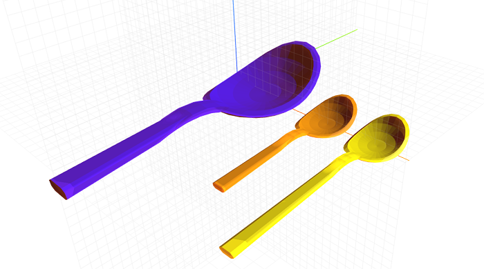

# craft-spoon

Parameterized spoon model.

### Install
	$ npm install craft-spoon

### Parameters
- length: adjusts length of spoon

### Example
```html
<craft>
	<craft name="spoon" module="craft-spoon"/>
	<lineup spacing = "2">
		<spoon length="15" size="2"></spoon>
		<spoon length="20"></spoon>
		<spoon></spoon>
	</lineup>
</craft>
```

